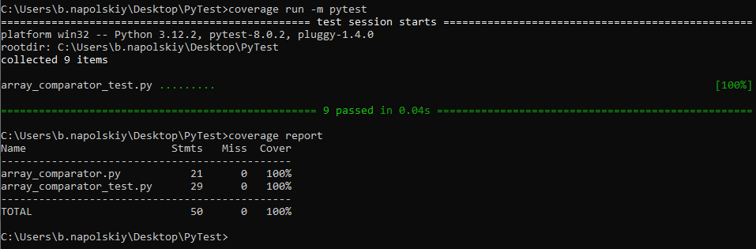

# Промежуточная аттестация по Unit-тестам
Для реализации тестов была написана программа на Python, которая сравнивает средние значения двух массивов и выдает результат, какое из них больше, либо они равны. 

Далее, были написаны тесты с использованием Pytest со следующими сценариями:

* **def test_compare_arrays_equal()** - проверяет, правильно ли функция определяет равность средних значений массивов;
* **def test_compare_arrays_first_bigger()** - проверяет, правильно ли функция опеределяет, что среднее значение первого массива больше;
* **def test_compare_arrays_second_bigger()** - проверяет, правильно ли функция опеределяет, что среднее значение второго массива больше;
* **def test_compare_arrays_empty()** - проверяет, правильно ли функция определяет сравнения пустых массивов;
* **def test_compare_arrays_zeros()** - проверяет, правильно ли функция определяет сравнения массивов, заполненных нулями;
* **def test_compare_arrays_negative_numbers()** - проверяет, правильно ли функция определяет сравнения массивов, если внутри имеются отрицательные элементы;
* **def test_compare_arrays_float_numbers()** - проверяет, правильно ли функция определяет сравнения массивов, если внутри имеются дробные числа;
* **def test_compare_arrays_one_empty()** - проверяет, правильно ли функция определяет сравнения массивов, если один из массивов пустой;
* **def test_compare_arrays_same_average_different_length()** - проверяет, правильно ли функция определяет сравнения массивов, если они имеют разную длину.

Указанные выше сценарии были выбраны, так как обеспечивают проверку корректности класса ArrayComparator в различных сценариях сравнения средних значений. Граничные случаи, как пустые массивы или заполненные нулями были включены для обеспечения обработки в специфичных условиях.

# Отчет о покрытии тестами

В качестве инструмента для проверки покрытия тестами код и отчета использовался **coverage**.

